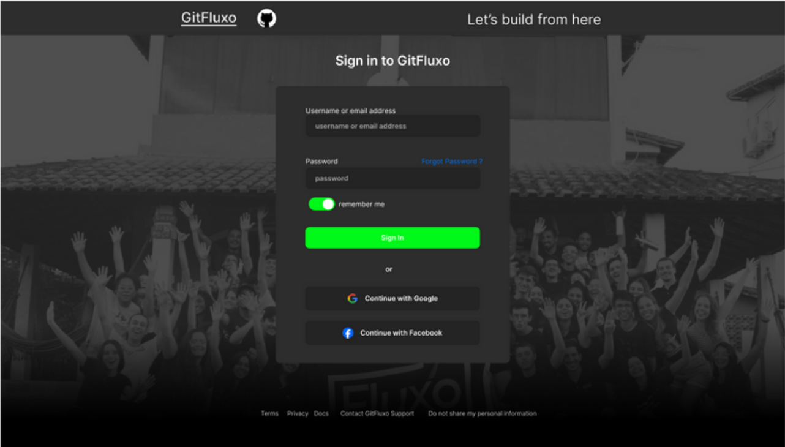

# Desafio Fluxo PAME 2024 - CCE
GITFLUXO

## Objetivo

Criar uma tela de um site ficticio com base na imagem fornecida:

- Quando for clicado enviar, um pop up (alerta) deve aparecer com as informações enviadas
confirmando o login

## A Fazer
- [x] Documentação de código e ReadMe

### HTML
- [x] Titulo e Icone da Página
- [x] Acrescentar descrição
- [x] Ajeitar os links de redirecionamento

### CSS
- [x] Ajeitar o background e inserir o degrade 
- [x] Inserir as imagens 
- [x] Pesquisar e adicionar as cores e font 
- [x] Terminar o Card-Formulario 
- [x] Ajustes Finos

### JavaScript
- [x] Botao de Envio de dados
- [x] Window alert com os inputs
- [x] Card Pop Up com os Inputs (Bonus/Opcional)

## Conclusão:

Do projeto, há pequenas diferenças em cor e tamanho do card de formulário. Além disso, em questão de responsividade, embora talvez falhe em telas bem pequena, funciona corretamente. 