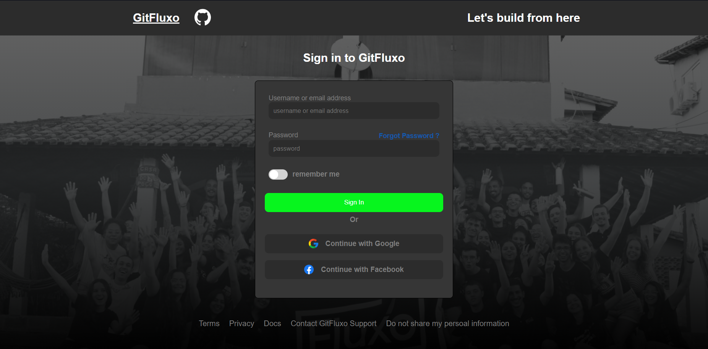

# Desafio Fluxo PAME 2024 - CCE
GITFLUXO

## Objetivo

Criar uma tela de um site ficticio com base na imagem fornecida:

- Quando for clicado enviar, um pop up (alerta) deve aparecer com as informações enviadas
confirmando o login

## A Fazer
- [] Documentação de código e ReadMe

### HTML
- [] Titulo e Icone da Página
- [] Acrescentar descrição
- [] Ajeitar os links de redirecionamento

### CSS
- [] Ajeitar o background e inserir o degrade 
- [] Inserir as imagens 
- [] Pesquisar e adicionar as cores e font 
- [] Terminar o Card-Formulario 
- [] Ajustes Finos

### JavaScript
- Botao de Envio de dados
- Window alert com os inputs
- Card Pop Up com os Inputs (Bonus/Opcional)